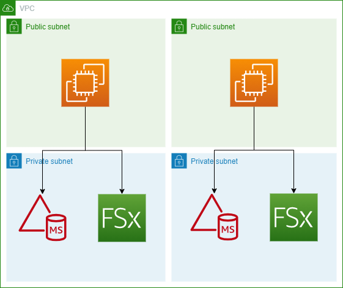

# Windows on AWS with Terraform 

Examples of various Windows workloads running on AWS built and deployed with Terraform.

## [Windows Server AD FSx](./src/windows-server-ad-fsx/main.tf)

Deploys:
- A VPC with 2 private and 2 public subnets
- An AWS Managed Active Directory in the private subnets
- An FSx for Windows fileshare in the private subnets
- 2 Domain Joined EC2 instances running Windows Server 2019 in the public subnets
